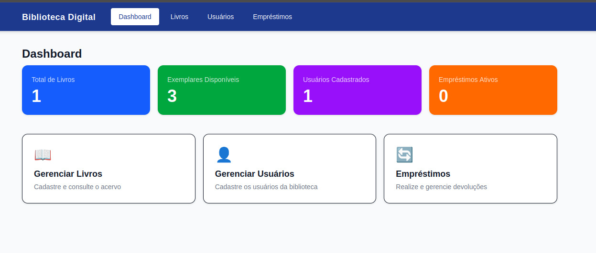

<h1 align="center">Biblioteca Digital — Frontend</h1>

<p align="center">
  Interface web do sistema de biblioteca digital acadêmico desenvolvido para a disciplina de POO.
</p>

<p align="center">
  
</p>

<p align="center">
  
</p>

## Tecnologias

- **Next.js 16.2.6** — framework React com App Router
- **React 19** — biblioteca de interface
- **TypeScript** — tipagem estática
- **Tailwind CSS v4** — estilização utilitária

## Estrutura do projeto

```
biblioteca-front/
├── app/
│   ├── layout.tsx           ← layout global
│   ├── page.tsx             ← dashboard principal
│   ├── livros/page.tsx      ← gestão de livros
│   ├── usuarios/page.tsx    ← gestão de usuários
│   └── emprestimos/page.tsx ← empréstimos e devoluções
├── components/
│   └── Navbar.tsx           ← barra de navegação
└── lib/
    └── api.ts               ← todas as chamadas HTTP ao backend
```

## Como rodar localmente

### Pré-requisitos

- Node.js 18 ou superior
- npm

### Passo a passo

1. **Clone o repositório:**

```bash
git clone https://github.com/pedroqueirozs/biblioteca_front.git
cd biblioteca_front
```

2. **Instale as dependências:**

```bash
npm install
```

3. **Configure a variável de ambiente:**

Crie um arquivo `.env.local` na raiz do projeto:

```env
NEXT_PUBLIC_API_URL=http://localhost:8080
```

> Para apontar para o backend em produção, use:
> `NEXT_PUBLIC_API_URL=https://biblioteca-backend-13i8.onrender.com`

4. **Inicie o servidor de desenvolvimento:**

```bash
npm run dev
```

A aplicação estará disponível em `http://localhost:3000`.

## Scripts disponíveis

| Comando | Descrição |
|---|---|
| `npm run dev` | Inicia o servidor de desenvolvimento |
| `npm run build` | Gera o build de produção |
| `npm run start` | Inicia o servidor em modo produção |
| `npm run lint` | Executa o linter |

## Deploy

O frontend está hospedado na **Vercel**.

URL de produção: `https://biblioteca-front-eosin.vercel.app`

Variável de ambiente configurada no painel da Vercel:

```
NEXT_PUBLIC_API_URL=https://biblioteca-backend-13i8.onrender.com
```

---

<p align="center">Feito por Pedro Douglas G. Queiroz</p>
